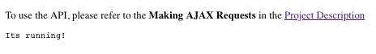
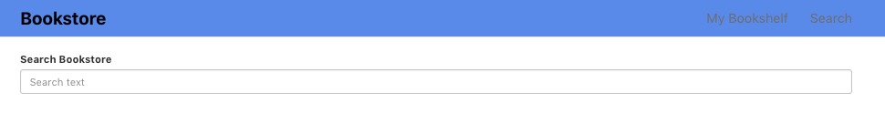
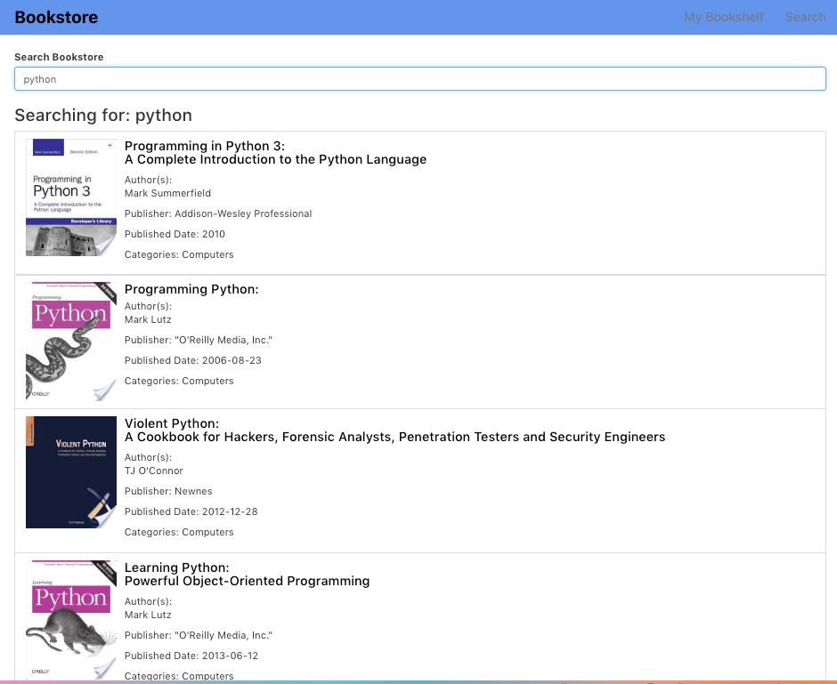
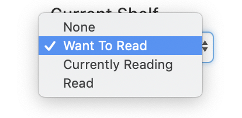
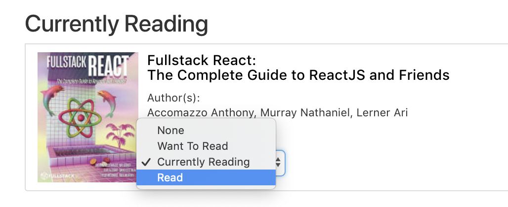

# Bookstore

This React project searches a Book API and allows users to assign books to specific shelves within their Bookshelf.

## Local Installation

The project requires the installation of both the API Server, which provides the books data, and the React App Server, which provides the application for viewing and manipulating the data.

### Step 1: Clone

Create a directory for this project, then inside this new project directory, *Clone* or *Download* the repository from *GitHub* using your terminal:

	$> cd app_directory/
	$> git clone https://github.com/simi823/bookstore.git
	
The contents of the `bookstore` directory should contain all the files and directories as displayed above.

### Step 2: API Server Start

To start the API Server execute these commands in the terminal:

	$> cd bookstore/server
	$> yarn install
	$> yarn start
	
This starts the API Server that allows access to the books database, which is available as *JSON*. To view, open `http://localhost:7000` in your browser.

This should be visible in the browser:

* * *

* * *

### Step 3: React App Start

To start the React App Server execute these command in the terminal:

	$> cd bookstore/
	$> yarn install
	$> yarn start

This start the React Bookstore Application that is visible in the Browser at `http://localhost:3000`.

This sould be visible in the browser:

* * *

* * *

## User Guide

### Searching for Books

User can search for books by typing keyword in the `Search Bookstore` field, either on the homepage (`/`) or on the **Search** page (`/search`) or clicking on **Search** link in the top navigation.

The results of the search will be displayed as follows, for example, when using the keyword `python`:

* * *

* * *

### Book Details

Each book can be viewed by clicking on the thumbnail or title. The **Book Details** view lists additional information about the book, like, subtitles, author(s), publishing date, publisher, and categories. In addition, the **Current Shelf** displays whether the current book saved to **My Bookshelf** or not. That is, if `None` is displayed in the drop-down, it is not saved to **My Bookshelf**.

### Shelves

There are three shelves available to choose from to add/remove from **My Bookshelf**:

* Want to Read
* Currently Reading
* Read

If the books does not exist in any of the shelves above, it will display **None**.

* * *

* * *

### Books in My Bookshelf

Click on the **My Bookshelf** link in the top navigation to view a list of books in the various shelves that have been saved. The books are grouped by the shelf name as listed above.

### Adding Books to My Bookshelf

From the **Search Results** click on the thumbnail or title of the desired book to view its *details* and add or remove from **My Bookshelf**.

### Remove Books from My Bookshelf

From the **Change Shelf** drop-down menu, select `None` to remove book from any shelf.

### Move or Update in My Bookshelf

From the **Change Shelf** drop-down menu, select a shelf to move book to another shelf.

* * *

* * *

## API Components

### NavBar

The **NavBar** component contains the links to the various sections of the website. The component is in `src/components/NavBar/NavBar.jsx` and uses `react-bootstrap` components `Navbar, Nav, NavItem`.

### Search

The **Search** component (which is mimiced on the home page or `/`) contains the main search box. The text string typed in the search box will run the `search` function that accesses the database via `axios` to return the results of books. The component is in `src/componenets/Search/Search.jsx` and uses `react-bootstrap` components `FormGroup, FormControl, ControlLabel, ListGroup, ListGroupItem, Media`.

### BookDetails

The **BookDetails** component contains the detailed information of a specific book. The `getBookDetails` function accesses data from the database via `axios` and with the `bookId` grabs the book details. The `updateShelf` function accesses data from the database via `axios` to move/update the shelf assignment for the current book.

### Bookshelf

The **Bookshelf** componenet contains the list of books assigned to shelves. The `getMyBookShelf` function accesses data from the database via `axios` and grabs a list of the books assigned to shelves. The `updateShelf` function accesses data from the database via `axios` to move/update the shelf assignment for the each of books in the bookshelf list.

